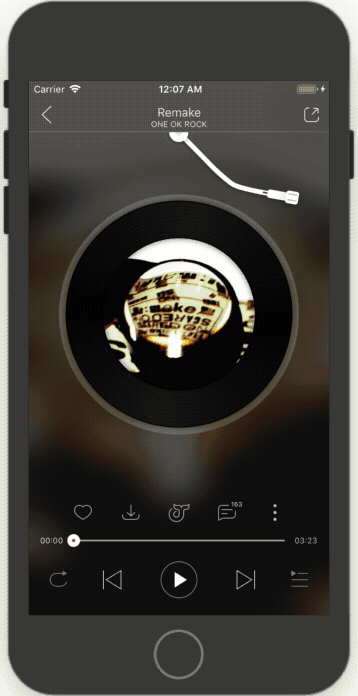

# Music163Demo

## 简介

高仿网易云音乐播放器，支持iOS10以上系统。本项目所有资源文件均来自于互联网，仅供学习探讨请勿商用。本项目如果对您有所帮助👍，谢谢Star支持✨✨

## 实现功能

1. 播放器播放、暂停、上一首、下一首
2. 播放模式切换，支持单曲循环、顺序播放、随机播放
3. 黑胶唱片仿真动画，左滑右滑切换
4. 后台播放及中断控制
5. 推荐运行机型iPhone6,7,8,X（其他机型暂未完成适配）

## 安装

1. 执行`$ git clone https://github.com/tianxueweii/Music163Demo.git`
2. 执行`$ pod install`或`$ pod update`
3. 自行配置证书

## 作者

tianxueweii, 382447269@qq.com

## 许可证

使用 MIT 许可证，详情见 LICENSE 文件。
